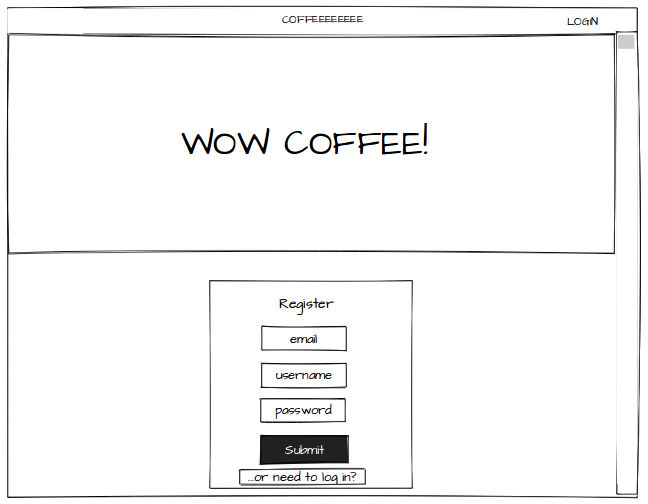
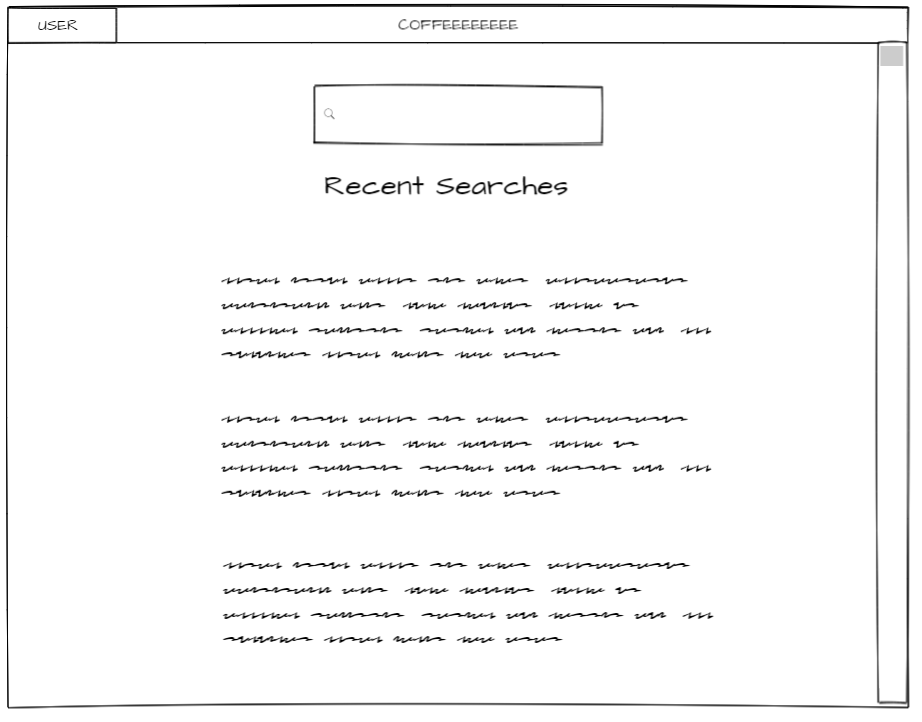
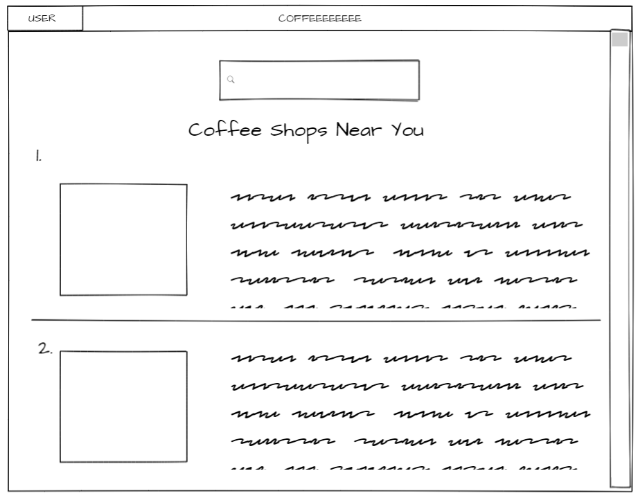
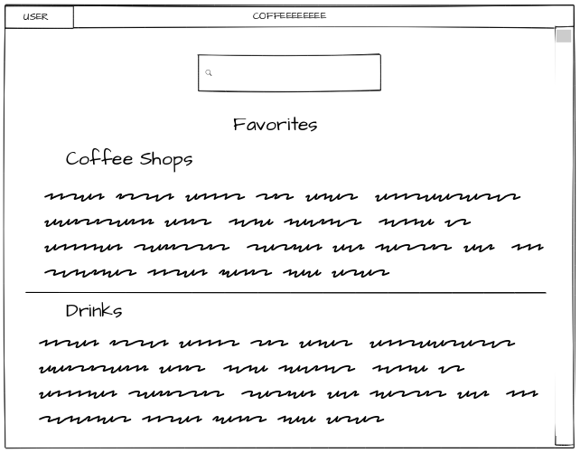
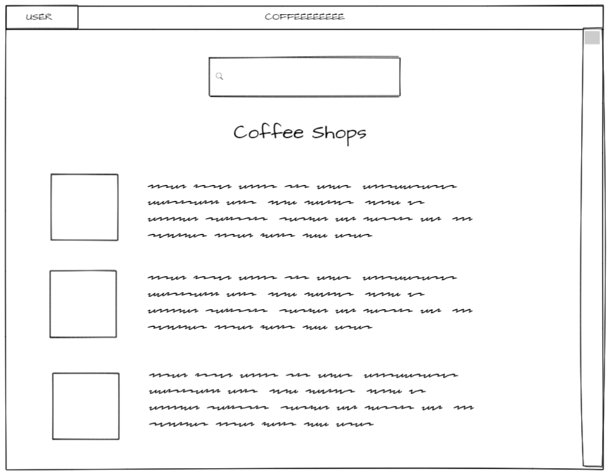
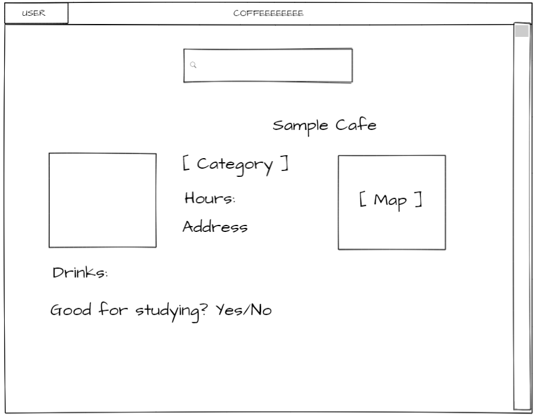
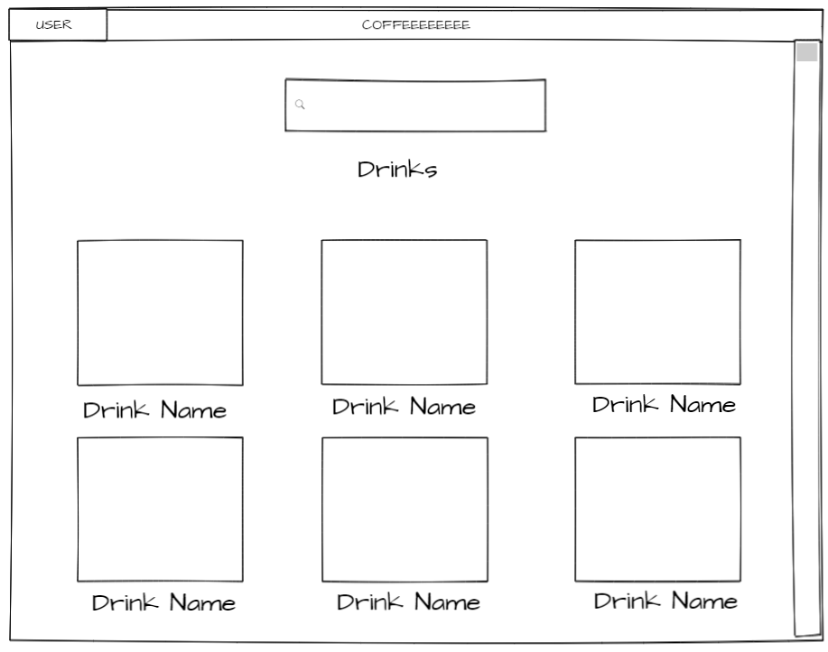
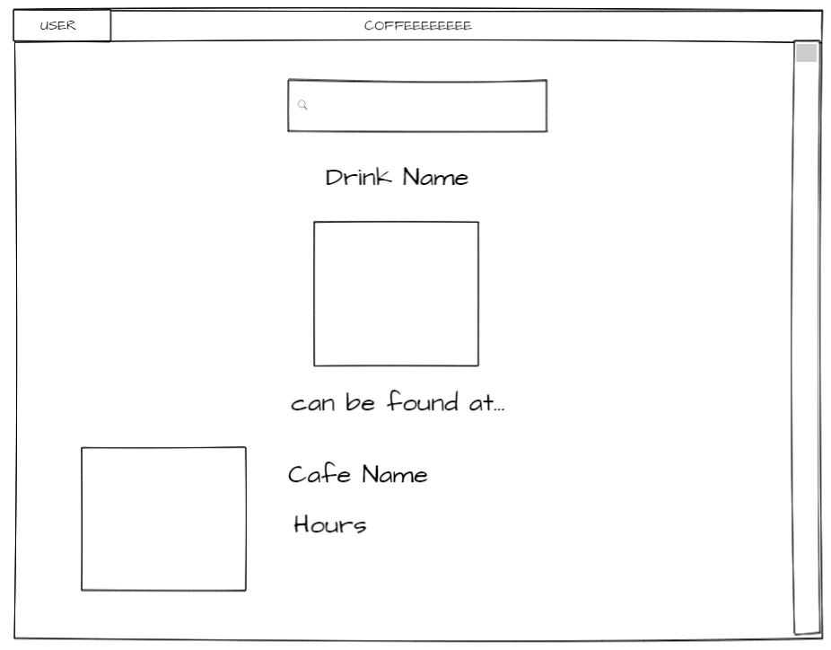
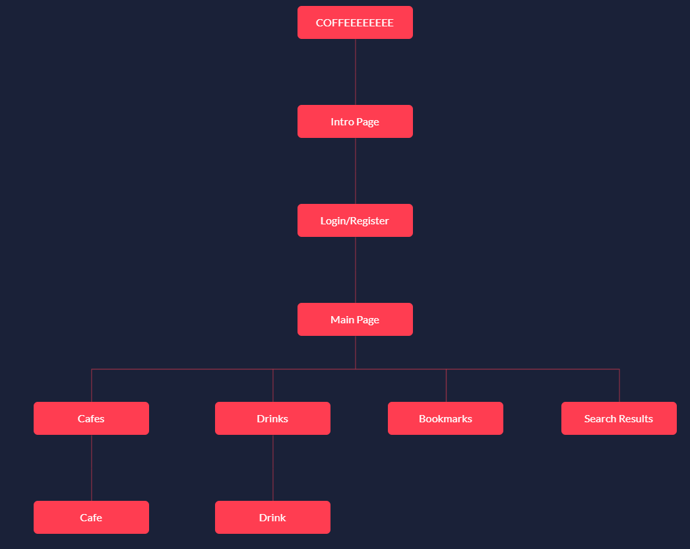

# COFFEEEEEEEE

## Overview

I love going to coffee shops to study and enjoy the vibes. But there are times where I crave a specific drink, or the place I want to go to doesn't approve of laptops (totally understandable), or maybe there's no space and I'd like to try a different place.

COFFEEEEEEEE is a web app that allows users to search for varieties of local coffee shops and cafes near them. Users can register, login, and bookmark coffee shops for the sake of going another day or to remind them that's their favorite. You are able to filter by drinks, time, closest location, internet access, and so on.

In the future, I would hope to develop this into a more elaborate platform where coffee culture can be incorporated and celebrated through this app. This could include job postings for baristas/waiters/waitresses/etc, listing events happening at the coffee shops, listing coffee festivals and general events, and other features to host the coffee community.

The name COFFEEEEEEEE is inspired by Cafe Madeline's storefront sign in Brooklyn. I always used to pass by in high school. 

## Data Model

The application will store Users, Bookmarks, Cafes and Drinks

* users can have multiple bookmarks of cafes and drinks (via referencing)
* each cafe can have multiple drinks (by embedding) and other information about the cafe

An Example User:

```javascript
{
  username: "corninna",
  password: "S3CR3T"
}
```

An Example Cafe Bookmark with Embedded Items:

```javascript
{
  user_id: // a reference to a User object
  cafe_name: 
}
```

An Example Cafe (also ref to Yelp API):

```javascript
{
  id: 4,
  name: "Roots Cafe",
  address: "639 5th Ave, Brooklyn, NY 11215",
  phone: "347-223-4614",
  website: "http://www.rootsbrooklyn.com",
  hours: [
    {
      "open": [
        {
          "is_overnight": false,
          "end": "2200",
          "day": 0,
          "start": "1730"
        },
        {
          "is_overnight": false,
          "end": "2200",
          "day": 1,
          "start": "1730"
        },
        {
          "is_overnight": false,
          "end": "2200",
          "day": 2,
          "start": "1730"
        },
        {
          "is_overnight": false,
          "end": "2200",
          "day": 3,
          "start": "1730"
        },
        {
          "is_overnight": false,
          "end": "2200",
          "day": 4,
          "start": "1730"
        },
        {
          "is_overnight": false,
          "end": "2200",
          "day": 5,
          "start": "1730"
        },
        {
          "is_overnight": false,
          "end": "2200",
          "day": 6,
          "start": "1730"
        }
      ],
      "is_open_now": false
    }
  ],
  categories: [
    { name: "American" }
  ],
  coordinates: [
    { latitude: 37.80587},
    { longitude: -122.42058}
  ],
  drinks: [
    { name: "Maple Butter Latte", coffee_id: 13},
    { name: "Maple Latte", coffee_id: 12},
  ],
  createdAt: // timestamp
}
```


## [Link to Commented First Draft Schema](db.js) 

[mongoose schema](https://github.com/nyu-csci-ua-0480-001-003-fall-2018/cyong813-final-project/blob/master/server/models)

## Wireframes

/ - introduction, login/register, after login shows recent searches



~~/user - main launch page showing recent searches~~



~~/search - page for display all coffee shops nearby entered location~~



/bookmarks - page for showing all bookmarked places/drinks



/cafes - page for showing all coffee shops and their drinks, other information about the shop



~~/cafes/slug - page for showing specific cafe~~



/drinks - page for showing all drinks



~~/drinks/slug - page for showing specific cafes with this drink~~



## Site map



## User Stories or Use Cases

1. as non-registered user, I can register a new account with the site
2. as a user, I can log in to the site
3. as a user, I can create bookmarks containing cafes and drinks
4. as a user, I can view all my bookmarks in a single list
5. as a user, I can add items to my bookmark list
~~6. as a user, I can view all cafes and filter accordingly~~

## Research Topics

* (3 points) Webpack to run MERN stack app
* (2 points) Concatenation and minification of CSS and JavaScript files
* (2 points) Sass because much more easier to use than pure CSS
* (2 points) PassportJS authentication, learned how to combine with MERN app (fun!)
* (5 points) React.js as the frontend framework
* (1 point) Google Map API for populating & visualizing coffee shop locations

15 points total out of 8 required points

## [Link to Initial Main Project File](app.js) 

[app](https://github.com/nyu-csci-ua-0480-001-003-fall-2018/cyong813-final-project/blob/master/server/server.js)

## Annotations / References Used

1. [MERN Stack Tutorial](https://blog.cloudboost.io/creating-your-first-mern-stack-application-b6604d12e4d3) [code] (https://github.com/umairraslam/expense-manager-mern)
2. [Securing MERN Stack Web-Application Using Passport](https://www.djamware.com/post/5a90c37980aca7059c14297a/securing-mern-stack-web-application-using-passport)
3. [React Google Maps](https://tomchentw.github.io/react-google-maps/#usage--configuration)